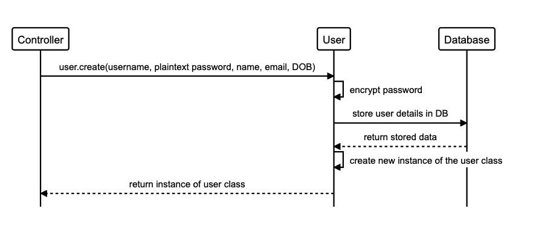

# AceBook


## Diagrams

```
alias c="Controller"
alias u="User"
alias p="Post"
alias db="Database"

c->u:"user.create(username, plaintext password, name, email, DOB)"
u->u:"encrypt password"
u->db:"store user details in DB"
db-->u:"return stored data"
u->u:"create new instance of the user class"
u-->c:"return instance of user class"
```



REQUIRED INSTRUCTIONS:

1. Fork this repository to `acebook-teamname` and customize
the below**

[You can find the engineering project outline here.](https://github.com/makersacademy/course/tree/master/engineering_projects/rails)

2. The card wall is here: <please update>

## How to contribute to this project
See [CONTRIBUTING.md](CONTRIBUTING.md)

## Quickstart

First, clone this repository. Then:

```bash
> bundle install
> bin/rails db:create
> bin/rails db:migrate

> bundle exec rspec # Run the tests to ensure it works
> bin/rails server # Start the server at localhost:3000
```

## Troubleshooting

If you don't have Node.js installed yet, you might run into this error when running rspec:
```
ExecJS::RuntimeUnavailable:
  Could not find a JavaScript runtime. See https://github.com/rails/execjs for a list of available runtimes.
 ```
That is because Rails will use a Javascript runtime (such as Node) under the hood. The easiest way is to install Node by running `brew install node` - 
and then run `bundle exec rspec` again
